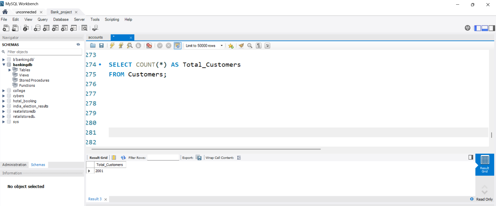
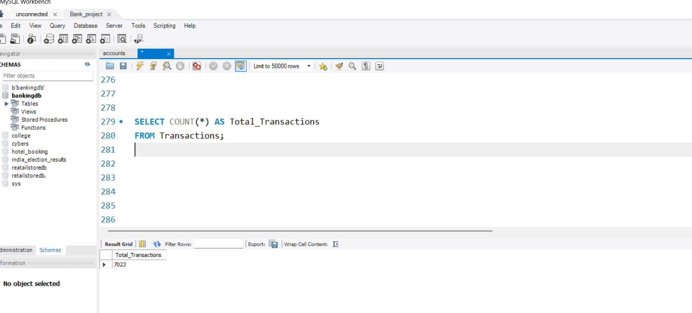
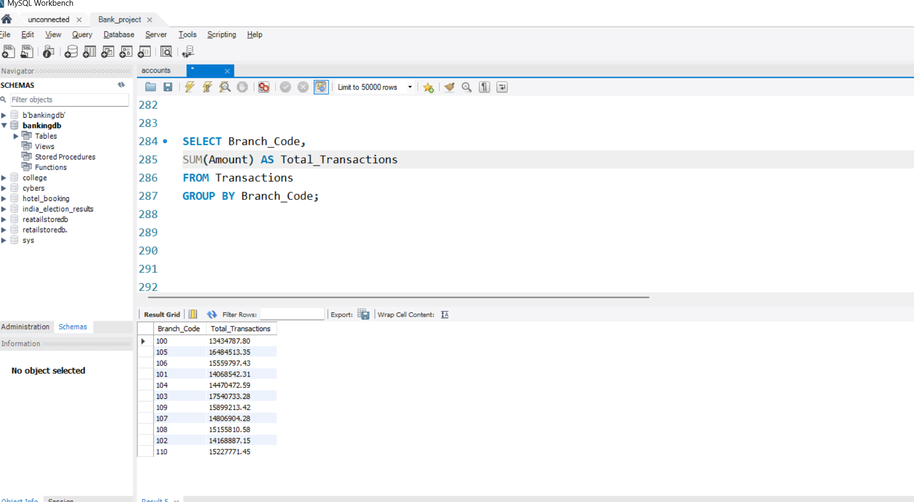

🏦 Banking Database and Transaction Analysis using SQL (MySQL)

📌 Project Overview

This project focuses on designing and implementing a Banking Database Management System using MySQL. The database stores customer, account, and transaction information and enables analytical reporting through SQL queries.

The project demonstrates database design, data management, and advanced SQL analytics using JOINs, Aggregate Functions, GROUP BY, Subqueries, and Common Table Expressions (CTEs).

🎯 Project Objectives

Design a normalized banking database.

Manage customer and account information.

Track financial transactions efficiently.

Perform customer and transaction analysis.

Generate business insights using SQL queries.

Support data-driven decision-making in banking operations.

🛠 Tools \& Technologies

MySQL

SQL

Relational Database Design

Joins

Aggregate Functions

Subqueries

Common Table Expressions (CTEs)

Data Analysis

📂 Database Structure

Customers Table

Customer\_ID

Customer\_Name

Gender

Age

City

State

Account\_Open\_Date

Accounts Table

Account\_ID

Customer\_ID

Account\_Type

Branch\_Code

Balance

Transactions Table

Transaction\_ID

Account\_ID

Transaction\_Date

Transaction\_Type

Amount

Balance\_After

Description

Branch\_Code

📊 SQL Analysis Performed

Customer Analysis

✔ Total Customers

✔ Customers with More Than 3 Accounts

✔ Customer Segmentation by Transaction Volume

✔ Top Customers by Average Transaction Amount

Transaction Analysis

✔ Total Transactions

✔ Monthly Transaction Volume

✔ Monthly Transaction Amount

✔ Highest Transaction Amount

✔ Lowest Transaction Amount

✔ Trend of Deposits Over Time

Financial Analysis

✔ Total Deposits

✔ Total Withdrawals

✔ Total Transfers

✔ Current Balance Analysis

✔ Average Balance by Account Type

✔ High-Risk Account Detection

Branch Analysis

✔ Branch-wise Total Transactions

✔ Branch-wise Average Transaction Amount

✔ Number of Accounts per Branch

✔ Top 5 Branches by Transaction Value

Demographic Analysis

✔ Age-wise Transaction Analysis

✔ Gender-wise Transaction Analysis

✔ Transaction Distribution by Customer Segment

📈 Key Insights Generated

Identified high-value customers based on transaction volume.

Analyzed branch performance using transaction data.

Monitored customer transaction behavior.

Detected high-risk accounts with unusual withdrawal patterns.

Evaluated transaction trends over time.

Generated customer segmentation for business strategy.

## 📷 Query Execution Screenshots

### Total Customers

**Description:** This query calculates the total number of customers present in the banking database. It helps in understanding the size of the customer base and overall business reach.

---

### Total Transactions

**Description:** This query displays the total number of transactions performed by customers. It is useful for measuring transaction activity and customer engagement.

---

### Branch-wise Transaction Analysis

**Description:** This query analyzes transaction amounts across different branches. It helps identify high-performing branches and supports branch performance evaluation.

---

### Gender-wise Transaction Analysis

**Description:** This query compares transaction amounts between male and female customers. It helps understand customer transaction behavior based on gender demographics.

---

📁 Project Structure

Banking-Database-and-Transaction-Analysis-SQL

│

├── Banking\_Database.sql

├── README.md

├── ER\_Diagram.png

└── SQL\_Query\_Screenshots

📚 SQL Concepts Used

CREATE DATABASE

CREATE TABLE

PRIMARY KEY

FOREIGN KEY

INSERT

SELECT

WHERE

ORDER BY

GROUP BY

HAVING

JOINS

Aggregate Functions

CASE Statements

Subqueries

Common Table Expressions (CTEs)

Date Functions

🚀 Business Applications

Banking Operations Management

Customer Analytics

Fraud Detection

Branch Performance Monitoring

Financial Reporting

Customer Segmentation

👩‍💻 Author

&nbsp;Aarti More

Bachelor of Engineering (AI\&DS)

📧 Email: aartimore445@gmail.com

🔗 LinkedIn:www.linkedin.com/in/aarti-more-data-analyst

📊 Aspiring Data Analyst

💼 Skills: Excel | SQL | Power BI | Python | Data Analytics

⭐ Project Highlights

✅ Database Design using MySQL

✅ Advanced SQL Querying

✅ Banking Transaction Analysis

✅ Customer Segmentation

✅ Branch Performance Analysis

✅ Real-World Banking Use Case

✅ Portfolio Project for Data Analyst Roles

